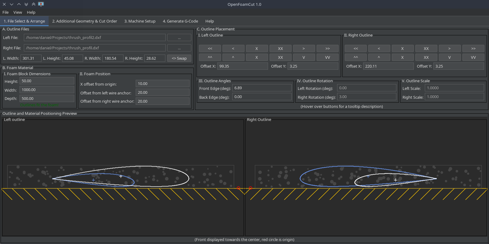
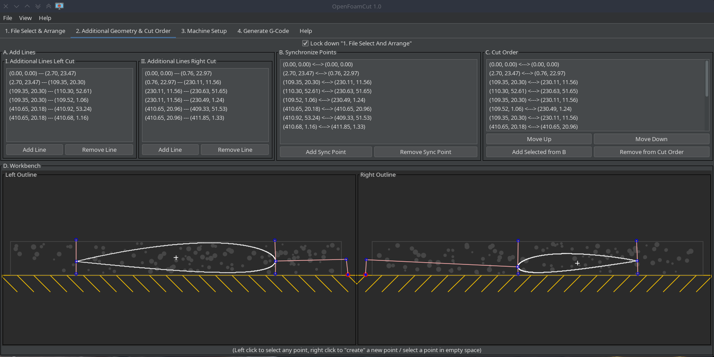
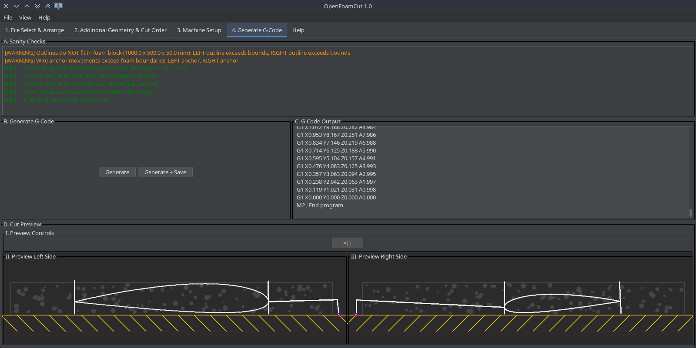

# OpenFoamCut

[](https://openjdk.org/)
[](#download-and-run)
[](#supported-input-files)
[](#supported-output-files)
[](LICENSE)

OpenFoamCut is a desktop application for preparing cutting jobs for 4-axis CNC hot-wire foam cutters.
It lets you load profile files, arrange the outlines, configure the machine, preview the result, and generate
G-code for synchronized left and right axis motion.

The application is aimed at users who want a straightforward workflow from profile geometry to machine-ready
output, without needing a separate chain of CAD and scripting tools.

## Highlights

- Load outline files in `.dxf` and `.dat` format.
- Parse `.dat` airfoil files in both Selig and Lednicer format.
- Arrange and inspect the geometry before cutting.
- Define machine parameters and reuse saved machine configurations.
- Save and load project files in `.ofc` format.
- Preview the resulting cut path before exporting G-code.
- Use the built-in Help tab inside the application while working.
- Keep the last session and machine settings between launches.

## Download And Run

OpenFoamCut is distributed as a runnable JAR file.

After downloading a release build, start it with:

```bash
java -jar openfoamcut-1.0.jar
```

If you build the project yourself, the packaged JAR is created in `target/`.

```bash
java -jar target/openfoamcut-1.0.jar
```

## Supported Input Files

- `.dxf` outline files
- `.dat` airfoil/profile files in Selig format
- `.dat` airfoil/profile files in Lednicer format

## Supported Output Files

- `.ofc` project files for saving and sharing sessions
- `.gcode` files for CNC machine execution

## Typical Workflow

1. Start OpenFoamCut.
2. Load the left and right outline files.
3. Arrange the geometry and check the fit.
4. Add cut-order or additional geometry as needed.
5. Configure the machine.
6. Generate and review the G-code output.
7. Use the cut preview before exporting or running the job.

## Screenshots

### Tab 1: File Select & Arrange
Load your outline files and arrange the geometry in the cutting space.



### Tab 2: Additional Geometry & Cut Order
Add extra lines or shapes and define the cutting sequence.



### Tab 4: Generate G-Code
Preview the cut path and export G-code for your machine.



## In-App Help

The application includes a built-in Help tab with usage guidance, so common workflow questions can be answered
directly inside the program while you work.

## What The Application Stores

OpenFoamCut keeps the machine configuration and machine profiles separate from project files. Project files (`.ofc`) contain the session state, allowing sharing of projects while keeping machine settings individual to users. The last application state is also saved for quick restoration on restart.

## For Developers

The project is written in Java 21 and built with Maven.

Build the packaged application with:

```bash
mvn clean package
```

Run the full verification build with tests and static analysis checks:

```bash
mvn clean verify
```

The repository includes unit tests, GUI initialization tests, and architecture tests.

## Contributing

Contributions are welcome, especially around parsing, G-code generation, machine handling, usability, and
documentation.

Please keep pull requests focused and run the full Maven verification build before submitting changes.

## License

OpenFoamCut is released under the MIT License. See [LICENSE](LICENSE) for details.
